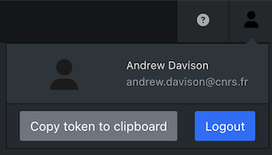
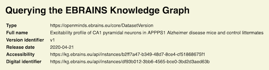
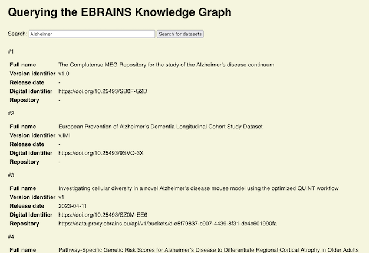
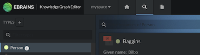

# Working with data from the EBRAINS Knowledge Graph: using simple Javascript

This repository contains a tutorial for working with the [EBRAINS Knowledge Graph](https://docs.kg.ebrains.eu),
which is the metadata management system of the [EBRAINS Research Infrastructure](https://www.ebrains.eu).

There are many different software tools for working with the Knowledge Graph (KG),
such as the [fairgraph](https://fairgraph.readthedocs.io) library for Python.
In this tutorial, we will demonstrate how to work with the KG in Javascript,
with results displayed in the web browser.
We use only standard Javascript APIs, to minimize dependencies and remove the need for a complex setup.

The tutorial contains exercises which require a basic knowledge of HTML and Javascript.
Suggested answers to each exercise are incorporated into the code in this repository following each exercise, and may be [viewed on GitHub](https://github.com/apdavison/ebrains-kg-tutorial-javascript/commits/main/).

## 1. Getting started

Each stage in the tutorial is represented by a Git tag. First, if you haven't already done so,
clone this repository to your local machine:

```bash
git clone https://github.com/apdavison/ebrains-kg-tutorial-javascript
cd ebrains-kg-tutorial-javascript
```

then move to the beginning of the tutorial:

```bash
git checkout part1
```

You should then run a local web server to view the web pages that we will develop in the tutorial.

If you have Python installed:

```bash
python3 -m http.server
```

or, if you have [Node.js](https://nodejs.org/) installed:

```bash
npx http-server -p 8000
```

You can then open [http://localhost:8000/querying_the_kg.html](http://localhost:8000/querying_the_kg.html) in your web browser.
Don't worry if you see an error message, this is expected at this point.

## 2. Key concepts

The core of the EBRAINS Knowledge Graph is a [graph database](https://en.wikipedia.org/wiki/Graph_database) containing detailed metadata about neuroscience datasets, models, software, and other research products.
The actual data/code of the datasets, models, etc. are stored outside the KG, but the KG stores links to the data/code locations.
The EBRAINS KG is implemented using an open-source software system called MarmotGraph (developed in the Humann Brain Project and EBRAINS projects).

The primary user interface of the KG is a web API, whose end-points are [documented interactively here](https://core.kg.ebrains.eu/swagger-ui/index.html).
In this tutorial we will use Javascript to send requests to this API and handle the responses,
but the API can be accessed using many different programming languages,
and EBRAINS provides libraries for [Python](https://pypi.org/project/ebrains-kg-core), [Java](https://central.sonatype.com/artifact/eu.ebrains.kg/kg-core-sdk[) and [Javascript/Typescript](https://www.npmjs.com/package/@ebrains/kg-core) to simplify working with the API.
Since this is a tutorial, we are going to use plain Javascript for simplicity,
but for larger Javascript projects you may wish to use the "@ebrains/kg-core" package from NPM.

The primary document type used by the KG API is [JSON-LD](https://json-ld.org).
This builds on the widely-used JSON format by adding features to support linked data,
i.e., data that follows a graph structure.

While JSON-LD specifies the form of the data/metadata, it doesn't specify the content.
[openMINDS](https://openminds-documentation.readthedocs.io/) is a project to develop metadata schemas and libraries for neuroscience and related fields.
It specifies what types of object we can store metadata about, and what properties each type should have, e.g., a `Person` should have a `givenName` and a `familyName`.
All metadata in the KG follows the openMINDS schemas.

## 3. Retrieving a metadata node based on its ID

First, take a look at the file `querying_the_kg.html` in this repository (make sure you've checked out the "part1" tag with Git, so that you're looking at the initial version of the file).

You can see that the HTML file contains a mostly empty table.
This table is where we will display the metadata for an EBRAINS dataset.

Retrieving the dataset from the KG is performed in the Javascript file `main.js`.
Looking at this file, you can see we have defined two functions, `getJSON()` and `loadDatasetVersion()`,
to retrieve a dataset version from the KG as a JSON-LD document.

### Authentication / authorization

Using the [KG API](https://core.kg.ebrains.eu/swagger-ui.html) is restricted to EBRAINS users who have agreed to the [Terms of Use](https://docs.kg.ebrains.eu/search-terms-of-use.html?v=2.2).
When making a request to the API, the user must provide an authorization token.
Obtaining such a token in a web app, by the user logging in with their EBRAINS account, is out of scope for this tutorial.
To continue with the tutorial, therefore, you will need to obtain a token from somewhere else.
Here are two possibilities:

1. Log-in to the [KG Editor](https://editor.kg.ebrains.eu) app, then click on the Account icon (top right), click on "Copy token to clipboard", then paste the token into `main.js` as the variable `authToken`.
Note that this token has quite a short validity, only about 10 minutes, so you will need to repeat this process from time to time as you work through the tutorial.



2. In a Jupyter notebook in the [EBRAINS Lab](https://lab.ebrains.eu/), run the following code:

```
from clb_nb_utils.oauth import get_token
get_token()
```

and then copy/paste the token into `main.js`. Tokens obtained from the Lab are valid for longer.

Once you've pasted your token, refresh the web page.
You should see something like this:



If you open the developer tools in your browser (e.g., in Firefox: Tools > Browser Tools > Web Developer Tools; in Chrome: View > Developer > Developer Tools), then go to the "Network" tab and click on the GET request to core.kg.ebrains.eu, you will see the underlying JSON response that is returned. It should look something like this:

```json
{
  "data": {
    "https://openminds.ebrains.eu/vocab/repository": [
      {
        "@id": "https://kg.ebrains.eu/api/instances/1a319b34-4903-4663-8882-b3fe5703cbcb"
      }
    ],
    "@type": [
      "https://openminds.ebrains.eu/core/DatasetVersion"
    ],
    "https://openminds.ebrains.eu/vocab/keyword": [
      {
        "@id": "https://kg.ebrains.eu/api/instances/62034f18-20fc-46d6-8f0a-277a60cb02e9"
      }
    ],
    "https://openminds.ebrains.eu/vocab/description": "",
    "https://openminds.ebrains.eu/vocab/preparationDesign": {
      "@id": "https://kg.ebrains.eu/api/instances/9f3abe1b-af7c-446d-b637-6a4f19ab7939"
    },
    "https://openminds.ebrains.eu/vocab/studyTarget": {
      "@id": "https://kg.ebrains.eu/api/instances/161baa02-4e08-4cf2-a641-81cf323cc15d"
    },
    "https://core.kg.ebrains.eu/vocab/meta/revision": "_hEUXe8S-_-",
    "https://openminds.ebrains.eu/vocab/studiedSpecimen": [
      {
        "@id": "https://kg.ebrains.eu/api/instances/d04d00c7-b770-4744-a5f4-2ebba26ba1d1"
      },
      {
        "@id": "https://kg.ebrains.eu/api/instances/31f9157a-616b-43b4-8a04-8fd8c15a7524"
      },
      {
        "@id": "https://kg.ebrains.eu/api/instances/853682c7-c317-4091-b3eb-f94ce41a70a5"
      },
      {
        "@id": "https://kg.ebrains.eu/api/instances/8300e9c8-ddce-4b72-811a-96f1f7dc0d4b"
      },
      {
        "@id": "https://kg.ebrains.eu/api/instances/eca80107-1908-43cc-8897-5074f50dbe22"
      },
      {
        "@id": "https://kg.ebrains.eu/api/instances/d74401a9-24a0-4373-b2b7-60b084b66820"
      },
      {
        "@id": "https://kg.ebrains.eu/api/instances/ed399971-9797-4fc3-8796-094ebdf2432e"
      },
      {
        "@id": "https://kg.ebrains.eu/api/instances/54e0bc42-9ddb-4503-98be-c1f3c03afea1"
      },
      {
        "@id": "https://kg.ebrains.eu/api/instances/d5ea0238-23e7-463e-96f3-4da7c06832e4"
      },
      {
        "@id": "https://kg.ebrains.eu/api/instances/6c00b1a4-d10f-408d-ac00-b07464a73321"
      },
      {
        "@id": "https://kg.ebrains.eu/api/instances/d352f598-0118-4908-ad01-a2c4b5e06028"
      },
      {
        "@id": "https://kg.ebrains.eu/api/instances/a9f319fb-9d41-4500-8eb4-08601053f850"
      },
      {
        "@id": "https://kg.ebrains.eu/api/instances/d2b62075-768e-48f4-ba00-4e8cbbb543e9"
      },
      {
        "@id": "https://kg.ebrains.eu/api/instances/9a83c827-3638-4bc1-92c2-10749d30500b"
      },
      {
        "@id": "https://kg.ebrains.eu/api/instances/dd214b93-8c20-4c70-ac90-584d7f66f344"
      },
      {
        "@id": "https://kg.ebrains.eu/api/instances/d967e53d-277d-4a2f-9090-8c50aaf0a008"
      },
      {
        "@id": "https://kg.ebrains.eu/api/instances/0cad429a-f738-4d1d-9e56-c907b431a8c9"
      },
      {
        "@id": "https://kg.ebrains.eu/api/instances/5f40bc15-d813-4560-92a8-a533109777fb"
      },
      {
        "@id": "https://kg.ebrains.eu/api/instances/0be6ad46-c50d-4a50-8e2b-0eeea708019e"
      },
      {
        "@id": "https://kg.ebrains.eu/api/instances/a7197a22-0b1d-4069-89b2-17aa92910c00"
      },
      {
        "@id": "https://kg.ebrains.eu/api/instances/524e0e51-6a9e-410b-8d23-79ce1b7d97b7"
      },
      {
        "@id": "https://kg.ebrains.eu/api/instances/12f80b23-6bec-4b0a-90c7-b717310fb707"
      },
      {
        "@id": "https://kg.ebrains.eu/api/instances/ae759252-c8e4-4c60-aa4c-308922613371"
      },
      {
        "@id": "https://kg.ebrains.eu/api/instances/e168745f-d7cf-4977-87d0-4dbeba51a9f2"
      },
      {
        "@id": "https://kg.ebrains.eu/api/instances/d44005cd-7d11-471f-9e34-4400463449ee"
      },
      {
        "@id": "https://kg.ebrains.eu/api/instances/7831a6bc-d329-4ff1-a5cf-270c100f9f8a"
      }
    ],
    "http://schema.org/identifier": [
      "https://kg.ebrains.eu/api/instances/bd5f91ff-e829-4b85-92eb-fc56991541f1",
      "https://nexus.humanbrainproject.org/v0/data/minds/core/dataset/v1.0.0/bd5f91ff-e829-4b85-92eb-fc56991541f1"
    ],
    "https://openminds.ebrains.eu/vocab/versionIdentifier": "v1",
    "https://openminds.ebrains.eu/vocab/fullName": "Excitability profile of CA1 pyramidal neurons in APPPS1 Alzheimer disease mice and control littermates",
    "https://openminds.ebrains.eu/vocab/shortName": "Excitability profile of CA1 pyramidal neurons in APPPS1 Alzheimer disease mice and control littermates",
    "https://core.kg.ebrains.eu/vocab/meta/space": "dataset",
    "https://openminds.ebrains.eu/vocab/releaseDate": "2020-04-21",
    "@id": "https://kg.ebrains.eu/api/instances/bd5f91ff-e829-4b85-92eb-fc56991541f1",
    "https://openminds.ebrains.eu/vocab/relatedPublication": {
      "@id": "https://kg.ebrains.eu/api/instances/5f477d01-82c1-4c6a-891c-e902a8c2241c"
    },
    "https://openminds.ebrains.eu/vocab/ethicsAssessment": {
      "@id": "https://kg.ebrains.eu/api/instances/a217a2f8-dcb8-4ca9-9923-517af2aebc5b"
    },
    "https://openminds.ebrains.eu/vocab/type": [],
    "https://openminds.ebrains.eu/vocab/author": [],
    "https://openminds.ebrains.eu/vocab/license": [
      {
        "@id": "https://kg.ebrains.eu/api/instances/64c1704b-db12-4b29-9541-b9143d081044"
      }
    ],
    "https://openminds.ebrains.eu/vocab/custodian": [],
    "https://openminds.ebrains.eu/vocab/accessibility": {
      "@id": "https://kg.ebrains.eu/api/instances/b2ff7a47-b349-48d7-8ce4-cf51868675f1"
    },
    "https://openminds.ebrains.eu/vocab/digitalIdentifier": {
      "@id": "https://kg.ebrains.eu/api/instances/df93b012-3bb6-4565-bce0-3bd2d3aed63b"
    },
    "https://openminds.ebrains.eu/vocab/versionInnovation": "This is the first version of this research product.",
    "https://openminds.ebrains.eu/vocab/experimentalApproach": {
      "@id": "https://kg.ebrains.eu/api/instances/411b233f-a054-4719-bbd5-e86f1302bc46"
    },
    "https://openminds.ebrains.eu/vocab/dataType": {
      "@id": "https://kg.ebrains.eu/api/instances/f468ee45-37a6-4e71-8b70-0cbe66d367db"
    },
    "https://openminds.ebrains.eu/vocab/fullDocumentation": {
      "@id": "https://kg.ebrains.eu/api/instances/a245c132-30ae-4ba8-a1d1-3a0f44d056aa"
    },
    "https://openminds.ebrains.eu/vocab/technique": [
      {
        "@id": "https://kg.ebrains.eu/api/instances/dc0bbc6c-99f5-4d3b-9c5e-e1bb7d59aa63"
      },
      {
        "@id": "https://kg.ebrains.eu/api/instances/ffc1c922-5ba9-4f03-b9be-05eb6fd0f294"
      }
    ],
    "https://core.kg.ebrains.eu/vocab/meta/firstReleasedAt": "2021-12-22T14:13:20.137Z",
    "https://core.kg.ebrains.eu/vocab/meta/lastReleasedAt": "2023-03-16T17:03:17.837Z"
  },
  "message": null,
  "error": null,
  "startTime": 1741187736127,
  "durationInMs": 512,
  "transactionId": null
}
```

For simplicity, we've only shown some of the metadata properties in the HTML table.

### Exercise

We have hard-coded a dataset ID in `main.js`.
Add an input and a button to allow the user to specify a dataset ID in the web page.

**Hints**: for those without much experience in writing HTML and Javascript,
use an [&lt;input type="text"&gt;](https://developer.mozilla.org/en-US/docs/Web/HTML/Element/input) element and a [&lt;button type="button"&gt;](https://developer.mozilla.org/en-US/docs/Web/HTML/Element/button) element.

When this is successfully running, save your changes using

```
git stash push
```

or by committing your changes to a branch, then move to the next stage of the tutorial using

```
git checkout part2
```

## 4. Following links in the graph

You will have noted that the "Accessibility" and "Digital identifier" properties are represented by URIs (a [URI](https://en.wikipedia.org/wiki/Uniform_Resource_Identifier) is like a [URL](https://en.wikipedia.org/wiki/URL), but doesn't necessarily resolve to a web page). In the JSON-LD document, they have the key "@id".

These represent links (or connections) in the Knowledge Graph.
Let's follow these links using the API.
First, we can rename `loadDatasetVersion()` to `loadKGNode()`,
because the code is not specific to dataset versions, but will work for any KG node.

Now let's add a function to follow links in the graph.
For this, we take the "@id" URI and extract the node identifier from the end of the URI, e.g.:

```
"https://kg.ebrains.eu/api/instances/df93b012-3bb6-4565-bce0-3bd2d3aed63b" → "df93b012-3bb6-4565-bce0-3bd2d3aed63b"
```

We can now use this identifier to retrieve the linked node using our just-renamed `loadKGNode()` function, and then update the JSON-LD document representing the dataset version, adding the linked documents we've just retrieved alongside the "@id".
All of this code goes in a new function `followLinks()`.

```javascript
async function followLinks(node, propertyNames) {
  /*
    For the given list of property names, we get the link URI from the node,
    extract the UUID from the URI, then use this to retrieve the linked node from the KG.
    We then replace the original property in the node object
    with the linked node that we've retrieved.
  */
  for (let propertyName of propertyNames) {
    const propertyPath = `https://openminds.ebrains.eu/vocab/${propertyName}`;
    const uri = node[propertyPath]["@id"];
    const uuid = uri.split("/").slice(-1)[0];
    const linkedNode = await loadKGNode(uuid);
    node[propertyPath] = linkedNode;
  }
}
```

We then update the `displayDatasetVersion()` function to display the linked nodes appropriately.

### Exercise

Try extending the HTML table to show additional linked properties, for example "dataType", "ethicsAssessment", "experimentalApproach" and/or "studyTarget".

When this is successfully running, save your changes using

```
git stash push
```

or by committing your changes to a branch, then move to the next stage of the tutorial using

```
git checkout part3
```

## 5. Searching the Knowledge Graph

We've seen how to retrieve a metadata node from the Knowledge Graph if we know the node's identifier, and one way to follow links in the graph.
In many cases, however, we don't know the node identifier, and so we need to search the graph to find datasets (or other objects) of interest.

For this, the KG provides a query language, also based on JSON-LD.
The [Query Builder](https://query.kg.ebrains.eu/) app provides a GUI for building such queries (see [video tutorial](https://docs.kg.ebrains.eu/9b511d36d7608eafc94ea43c918f16b6/tutorials.html).)

The following query lets us search for dataset versions based on the dataset name.
It returns the name, together with the "versionIdentifier" and "releaseDate" properties.

```javascript
{
  "@context": {
    "@vocab": "https://core.kg.ebrains.eu/vocab/query/",
    "query": "http://example.org/",
    "propertyName": {
      "@id": "propertyName",
      "@type": "@id"
    },
    "path": {
      "@id": "path",
      "@type": "@id"
    }
  },
  "meta": {
    "type": "https://openminds.ebrains.eu/core/DatasetVersion",
    "responseVocab": "http://example.org/"
  },
  "structure": [
    {
      "propertyName": "query:fullName",
      "path": "https://openminds.ebrains.eu/vocab/fullName",
      "required": true,
      "filter": {
        "op": "CONTAINS",
        "value": "APPPS1 Alzheimer disease mice"
      }
    },
    {
      "propertyName": "query:versionIdentifier",
      "path": "https://openminds.ebrains.eu/vocab/versionIdentifier"
    },
    {
      "propertyName": "query:releaseDate",
      "path": "https://openminds.ebrains.eu/vocab/releaseDate"
    }
  ]
}
```

Sending this query returns the following document:

```json
{
  "data": [
    {
      "@context": {
        "@vocab": "http://example.org/"
      },
      "releaseDate": "2020-04-21",
      "versionIdentifier": "v1",
      "fullName": "Excitability profile of CA1 pyramidal neurons in APPPS1 Alzheimer disease mice and control littermates"
    }
  ],
  "total": 1,
  "size": 1,
  "from": 0
}
```

Let's modify our web page to search for dataset versions based on their full name.
First, we add a function `postQuery()`, similar to `getJSON()`, but targeting the `POST /queries/` endpoint of the API (note: queries you use regularly can be saved to the KG and run with a GET request, but for one-off or rarely-used queries the POST endpoint should be used).

Next, we add a function `queryKG()`, which accepts a search term, constructs a JSON-LD query document similar to the one shown above, sends the query to the KG, and returns the results.

Finally, we modify the HTML document and the `displayDatasetVersion()` function.
The HTML document is much shorter now: since we don't know how many datasets we will retrieve,
we cannot put the markup directly in the document; rather we need to add it with Javascript.

Refresh the web page, and experiment with different search terms.

Now move on to Part 4:

```
git checkout part4
```

## 6. Searching across links

In our query so far, we've only retrieved simple text properties.
The query language also allows us to retrieve properties that represent links in the graph.

For example, if we add the following to the query shown above, we will retrieve the DOI of the dataset, together with the names and locations (IRI) of the repositories that contain the actual data files for each dataset.

```json
{
  "propertyName": "query:digitalIdentifier",
  "path": "https://openminds.ebrains.eu/vocab/digitalIdentifier",
  "structure": {
    "propertyName": "query:identifier",
    "path": "https://openminds.ebrains.eu/vocab/identifier"
  }
},
{
  "propertyName": "query:repository",
  "path": "https://openminds.ebrains.eu/vocab/repository",
  "structure": [
    {
      "propertyName": "query:name",
      "path": "https://openminds.ebrains.eu/vocab/name"
    },
    {
      "propertyName": "query:IRI",
      "path": "https://openminds.ebrains.eu/vocab/IRI"
    }
  ]
}
```

The search results will look something like this:

```json
{
  "@context": {
    "@vocab": "https://schema.hbp.eu/myQuery/"
  },
  "digitalIdentifier": [
    {
      "identifier": "https://doi.org/10.25493/YJFW-HPY"
    }
  ],
  "versionIdentifier": "v1",
  "fullName": "Excitability profile of CA1 pyramidal neurons in APPPS1 Alzheimer disease mice and control littermates",
  "repository": [
    {
      "IRI": "https://object.cscs.ch/v1/AUTH_c0a333ecf7c045809321ce9d9ecdfdea/ext-d000001_ADNeuronModel_pub",
      "name": "ext-d000001_ADNeuronModel_pub"
    }
  ],
  "releaseDate": "2020-04-21"
}
```

As an extra convenience, if a linked node has only a single property of interest (e.g., "digitalIdentifier"→"identifier") we can flatten the result by making the query "path" an array, e.g.:

```json
{
  "propertyName": "query:digitalIdentifier",
  "singleValue": "FIRST",
  "path": [
    "https://openminds.ebrains.eu/vocab/digitalIdentifier",
    "https://openminds.ebrains.eu/vocab/identifier"
  ]
}
```

with the result:

```json
"digitalIdentifier": "https://doi.org/10.25493/YJFW-HPY"
```

instead of

```json
"digitalIdentifier": [
    {
      "identifier": "https://doi.org/10.25493/YJFW-HPY"
    }
]
```

### Inheritance of properties, and reverse links

You may notice that some search terms give fewer results than you might have expected.
Using the search term "Alzheimer" gives a single result with our web page,
but [multiple responses in the KG Search UI](https://search.kg.ebrains.eu/?category=Dataset&q=Alzheimer).

One reason for this is that the Search UI searches both the "fullName" and "description" properties.
Another is that sometimes the fullName property comes from the parent dataset record, and is not set on an individual dataset version.

openMINDS distinguishes between a `Dataset` and a `DatasetVersion`.
Each dataset can have multiple versions.
Both `Dataset` and `DatasetVersion` have "name" and "description" properties.
The convention in the EBRAINS Knowledge Graph [Search UI](https://search.kg.ebrains.eu/) is that if the "name" property of a `DatasetVersion` is empty, it should inherit it from the parent `DataSet`.

Fortunately, we can do the same thing in our query.
In our original query above, if we modify the "fullName" part as follows,
we will search the `fullName` property of the parent `Dataset`, not of the `DatasetVersion`.
Note that the "path" is now an array rather than a string.
The first element of the array represents the link from `DatasetVersion` to its parent `Dataset`.
It is a "reverse" link, because "hasVersion" is a property of `Dataset`, which points to a `DatasetVersion`.

```json
{
  "propertyName": "query:fullName",
  "required": true,
  "filter": {
    "op": "CONTAINS",
    "value": "Alzheimer"
  },
  "path": [
    {
      "@id": "https://openminds.ebrains.eu/vocab/hasVersion",
      "reverse": true
    },
    "https://openminds.ebrains.eu/vocab/fullName"
  ]
}
```

After adding these query changes to `main.js` and modifying the `displayDatasetVersion()` function accordingly, we now retrieve and visualize more of the information about each dataset.
If you've checked out the "part4" tag, you should see something like this:




### Exercise

Extend the query and the display code to show additional linked properties, for example "dataType", "ethicsAssessment", "experimentalApproach" and/or "studyTarget".

When this is successfully running, save your changes using

```
git stash push
```

or by committing your changes to a branch, then move to the next stage of the tutorial using

```
git checkout part5
```

## 7. Writing to the Knowledge Graph

When sharing scientific data and the associated metadata,
especially sensitive or pre-publication data,
it is important to consider who has access to the data,
and who has permissions to create or modify metadata.

The EBRAINS Knowledge Graph is divided into different spaces,
each with its own access control permissions.
By default, the core API searches across all spaces for which a user has "read" permission,
although it is possible to restrict searches to specific spaces.

Public metadata in the EBRAINS KG are stored in curated spaces,
to which only nominated curators have write access.
This ensures high standards of quality control.

However, each user has their own private space in the KG, called "myspace",
and user may also create shared private spaces,
associated with a collab workspace in the [EBRAINS Collaboratory](https://wiki.ebrains.eu/).

In this part of the tutorial, we will create a simple web form that lets you add metadata nodes,
conforming to openMINDS schemas, to your "myspace".

For this, we add a new HTML page, [`feeding_the_kg.html`](http://localhost:8000/feeding_the_kg.html),
containing a form that lets us add `Person` nodes to the KG.
The openMINDS `Person` schema allows us to specify affiliations, ORCID identifiers, and other properties,
but for simplicity we'll just specify the person's name in our form.

We use the same `main.js` file as for the search page,
but we split the `main()` function into two parts: `searchView()` and `saveView()`.
The `saveView()` function:
1. queries the KG to retrieve a list of `Person` nodes in your myspace (this will probably we empty at first, unless you have worked with the KG before), and displays this list on the page.
2. responds to a click on the "Save" button by creating a JSON-LD document conforming to the `Person` schema, and uploading it to the KG, in your "myspace", using the API.
3. queries the KG again to update the list of `Person` nodes.

One more important thing to note: when querying the endpoint to get a list of people,
we pass the option `stage=IN_PROGRESS`,
whereas when retrieving published datasets we used the option `stage=RELEASED`.

When first creating a new node in the KG, it is set to the status "In progress".
Only after quality control checks, and when we wish to publish the metadata,
is the node set to "Released" status.

Try adding some people to your "myspace" using the form.
You can also view them in the [KG Editor app](https://editor.kg.ebrains.eu/),
as shown below:



### Exercise

You may have noticed that the form allows you to enter the same person more than once.
If not, give it a try to convince yourself!

Add a check that a person's full name does not already exist in "myspace", and show an error message if it does.

**Note**: if you need to delete a person, you can do this in the KG Editor, or use a [DELETE request to the core API](https://core.kg.ebrains.eu/swagger-ui/index.html#/1%20Basic/deleteInstance).

## 8. Conclusions

This is the end of the tutorial.
The aim was to give you an understanding of some of the key concepts, and to give you experience with querying, retrieving, and creating metadata nodes in the EBRAINS Knowledge Graph, using Javascript.

We are also developing a tutorial on using Python,
specifically using the [fairgraph](https://fairgraph.readthedocs.io/) library,
and will add a link here when this is complete.

If you are interested in developing your own web app that works with metadata in the KG,
the main missing piece not covered in this tutorial is authentication/authorization
(manually pasting a token is ok for development, but for a production app the token should come from a user login).
For this we recommend used the "keycloak-js" Javascript library.
For more information on this, see the [EBRAINS documentation](https://wiki.ebrains.eu/bin/view/Collabs/the-collaboratory/Documentation%20IAM/).

If you have questions, or wish to give feedback on this tutorial,
please feel free to post in the [discussion on GitHub](https://github.com/apdavison/ebrains-kg-tutorial-javascript/discussions).
